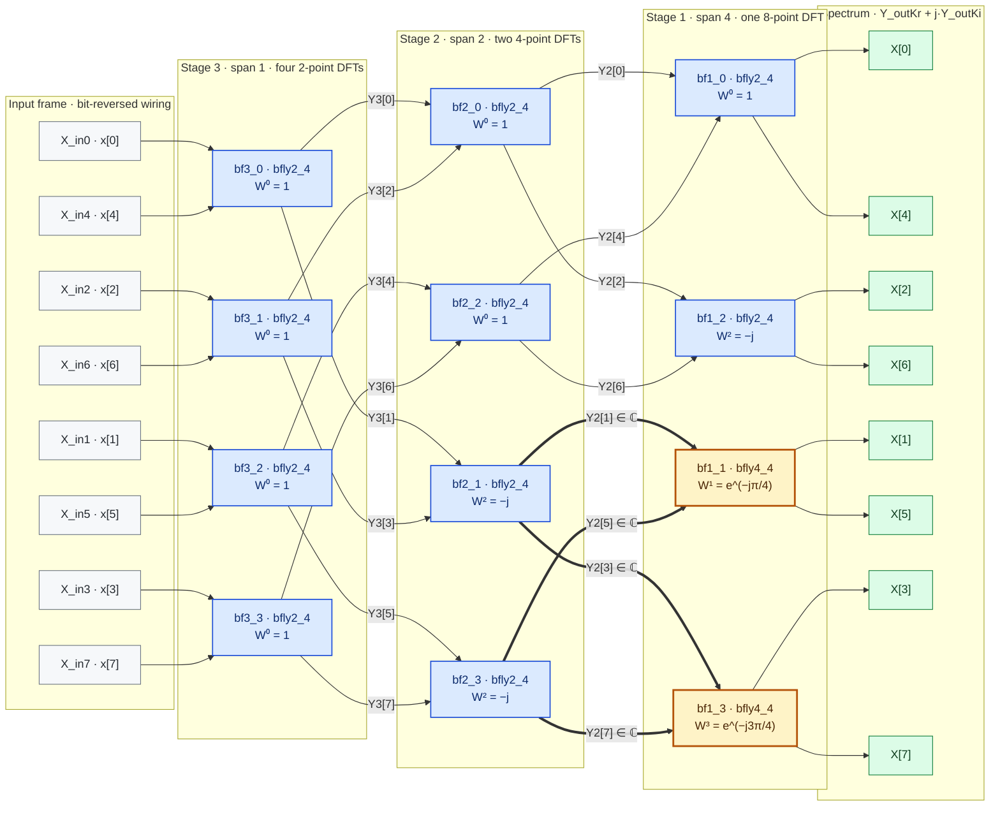
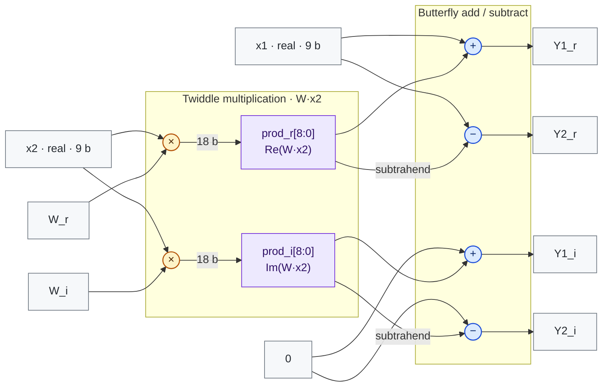
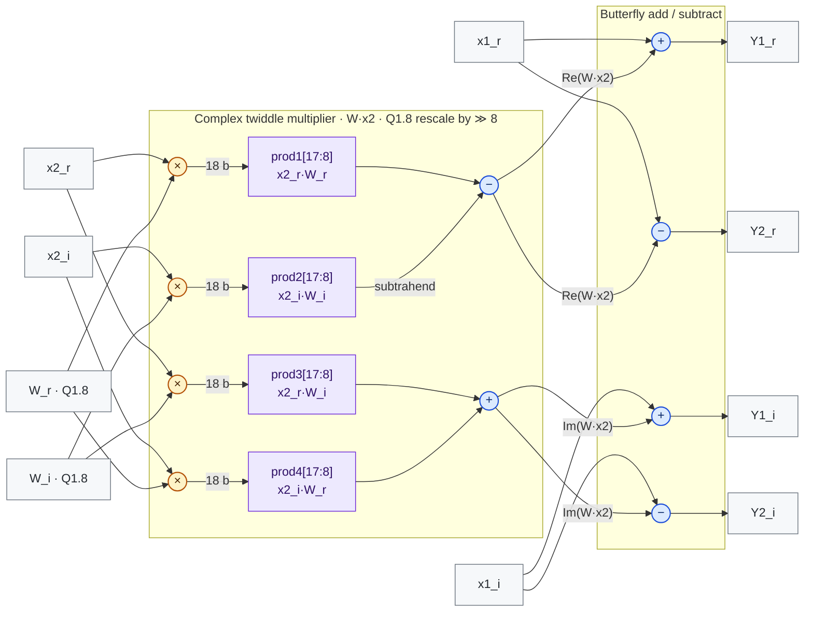

# DIT-FFT8
A compact 8-point radix-2 DIT FFT in Verilog, specialized for real-valued inputs, Q1.8 fixed point, two butterfly variants, fully combinational.
<div align="center">

<h1>8-Point DIT-FFT Hardware Core</h1>

<p><b>Decimation-in-Time Fast Fourier Transform &nbsp;·&nbsp; Structural Verilog RTL</b></p>

<p>
  
  
  
  
  <a href="#known-issue-w3-twiddle-sign"></a>
</p>

<p><i>A fully parallel, purely combinational butterfly network that computes the complete<br>eight-bin complex spectrum of a real-valued, 9-bit input frame.</i></p>

</div>

---

## Table of Contents

1. [Project Overview](#1-project-overview)
2. [System Architecture](#2-system-architecture)
3. [Theoretical & Hardware Background](#3-theoretical--hardware-background)
4. [Hardware Module Hierarchy](#4-hardware-module-hierarchy)
5. [Directory Structure](#5-directory-structure)
6. [Simulation & Verification](#6-simulation--verification)
7. [Design Extensions](#7-design-extensions)
8. [References](#8-references)

---

## 1. Project Overview

`DIT_FFT_8` is a synthesizable hardware implementation of the 8-point **Decimation-in-Time (DIT) Fast Fourier Transform**. It takes one frame of eight real-valued, 9-bit two's-complement time-domain samples and computes all eight complex frequency bins in a single combinational evaluation. It has no clock, reset, or control handshake.

The RTL follows the standard radix-2 DIT butterfly network one-to-one. It uses twelve explicitly instantiated processing elements (PEs) in three stages, and the bit-reversal permutation is done entirely by the input wiring. The key design choice is **domain-aware PE specialization**. Tracing which nets can carry imaginary values shows that ten of the twelve butterflies only ever receive real inputs. Those ten use a reduced two-multiplier element (`bfly2_4`). The full complex element (`bfly4_4`) is used only for the two butterflies that actually receive complex inputs.

### Design Highlights

- **Structural fidelity:** Each RTL instance (`bf<stage>_<index>`) corresponds to one butterfly in the textbook network, so you can check the RTL directly against the signal-flow diagram.
- **Domain-aware specialization:** The core uses 28 behavioral multipliers instead of the 48 that a uniform complex implementation would need. Only 8 of the 28 multiply by a non-trivial constant.
- **Multiplier-free trivial twiddles:** $`W^0 = 1`$ and $`W^2 = -j`$ are applied as exact integers. After the hierarchy is flattened, synthesis constant propagation can reduce those products to wiring and negation.
- **Zero-cost bit reversal:** The input permutation $`(0,4,2,6,1,5,3,7)`$ is implemented purely through port connections.
- **Documented fixed-point behavior:** Word growth, the safe input range, coefficient quantization, and truncation error are all specified in [Section 3](#fixed-point-arithmetic--dynamic-range).

### Key Specifications

| Parameter | Value |
|:--|:--|
| **Transform** | 8-point forward DFT, $`X[k]=\sum_{n=0}^{7} x[n]\,e^{-j2\pi kn/8}`$ |
| **Algorithm** | Iterative radix-2 Decimation-in-Time FFT |
| **Architecture** | Fully parallel (unfolded), purely combinational |
| **Network depth** | $`\log_2 N = 3`$ butterfly stages |
| **Processing elements** | $`\tfrac{N}{2}\log_2 N = 12`$ butterflies: 10 × `bfly2_4`, 2 × `bfly4_4` |
| **Input interface** | 8 × 9-bit two's-complement real samples (`X_in0` … `X_in7`) |
| **Output interface** | 8 complex bins on 16 × 9-bit buses (`Y_outKr`, `Y_outKi`) |
| **Twiddle factors** | $`W_8^0 \dots W_8^3`$ as hard-wired parameters (no coefficient ROM) |
| **Coefficient format** | Q1.8 for $`W^1, W^3`$; exact integers for $`W^0, W^2`$ |
| **Latency** | 0 clock cycles (combinational) |
| **Safe input range** | $`[-32,\ +31]`$ (6-bit signed), guaranteed overflow-free |
| **HDL standard** | Verilog-2001 (IEEE 1364-2001) |

---

## 2. System Architecture

### Signal Flow & Data Path

Data moves left to right through three butterfly stages. Stage numbering follows the RTL, so **Stage 3 is on the input side** and **Stage 1 produces the spectrum**. Each stage doubles the butterfly span $`h`$, merging pairs of smaller sub-transforms into one transform twice the size.



> **Legend:** Blue boxes are `bfly2_4` (real operands) and amber boxes are `bfly4_4` (complex operands). Thick edges carry complex values, so both the `_r` and `_i` buses are routed. Thin edges carry values that are provably real, so only the `_r` bus is routed. Edge labels are the RTL net names (`Y3_r/Y3_i`, `Y2_r/Y2_i`).

### Reference Butterfly Network

<p align="center">
  
</p>

<p align="center"><sub><b>Figure 1.</b> Annotated 8-point DIT butterfly network (<code>Description/butterflies.PNG</code>).
Red: provably real vectors. Green: the two <i>W²</i> butterflies that first produce complex values.
Blue: the two complex-input butterflies realized with <code>bfly4_4</code>.</sub></p>

### Instance Connectivity Map

Every butterfly computes $`Y_1 = x_1 + W x_2`$ and $`Y_2 = x_1 - W x_2`$.

| Stage | Span $`h`$ | Instance | PE | $`x_1`$ | $`x_2`$ | $`W`$ | $`Y_1`$ | $`Y_2`$ | Domain |
|:-:|:-:|:--|:--|:--|:--|:-:|:--|:--|:-:|
| 3 | 1 | `bf3_0` | `bfly2_4` | `X_in0` | `X_in4` | $`W^0`$ | `Y3[0]` | `Y3[1]` | ℝ → ℝ |
| 3 | 1 | `bf3_1` | `bfly2_4` | `X_in2` | `X_in6` | $`W^0`$ | `Y3[2]` | `Y3[3]` | ℝ → ℝ |
| 3 | 1 | `bf3_2` | `bfly2_4` | `X_in1` | `X_in5` | $`W^0`$ | `Y3[4]` | `Y3[5]` | ℝ → ℝ |
| 3 | 1 | `bf3_3` | `bfly2_4` | `X_in3` | `X_in7` | $`W^0`$ | `Y3[6]` | `Y3[7]` | ℝ → ℝ |
| 2 | 2 | `bf2_0` | `bfly2_4` | `Y3[0]` | `Y3[2]` | $`W^0`$ | `Y2[0]` | `Y2[2]` | ℝ → ℝ |
| 2 | 2 | `bf2_1` | `bfly2_4` | `Y3[1]` | `Y3[3]` | $`W^2`$ | `Y2[1]` | `Y2[3]` | ℝ → ℂ |
| 2 | 2 | `bf2_2` | `bfly2_4` | `Y3[4]` | `Y3[6]` | $`W^0`$ | `Y2[4]` | `Y2[6]` | ℝ → ℝ |
| 2 | 2 | `bf2_3` | `bfly2_4` | `Y3[5]` | `Y3[7]` | $`W^2`$ | `Y2[5]` | `Y2[7]` | ℝ → ℂ |
| 1 | 4 | `bf1_0` | `bfly2_4` | `Y2[0]` | `Y2[4]` | $`W^0`$ | `X[0]` | `X[4]` | ℝ → ℝ |
| 1 | 4 | `bf1_1` | **`bfly4_4`** | `Y2[1]` | `Y2[5]` | $`W^1`$ | `X[1]` | `X[5]` | ℂ → ℂ |
| 1 | 4 | `bf1_2` | `bfly2_4` | `Y2[2]` | `Y2[6]` | $`W^2`$ | `X[2]` | `X[6]` | ℝ → ℂ |
| 1 | 4 | `bf1_3` | **`bfly4_4`** | `Y2[3]` | `Y2[7]` | $`W^3`$ | `X[3]` | `X[7]` | ℂ → ℂ |

### Signal-Domain Analysis

The choice between the two PE types follows from tracing where imaginary components first appear:

1. **Primary inputs are real.** `X_in0` … `X_in7` carry real time-domain samples.
2. **Stage 3 stays real.** All four butterflies use $`W^0 = 1`$, so $`x_1 \pm x_2`$ is real and every `Y3_i` net is identically zero.
3. **Stage 2 is mixed.** `bf2_0` and `bf2_2` ($`W^0`$) stay real. `bf2_1` and `bf2_3` ($`W^2 = -j`$) rotate $`x_2`$ onto the imaginary axis, producing $`Y_{1,2} = x_1 \mp j x_2`$.
4. **Stage 1 inherits the split.** `bf1_0` and `bf1_2` read only the real even-indexed nets `Y2[0,2,4,6]`. `bf1_1` and `bf1_3` read the complex odd-indexed nets `Y2[1,3,5,7]` and therefore require the full complex multiplier.

The nets known to be zero (`Y3_i[*]` and `Y2_i[0,2,4,6]`) are driven but never read, so synthesis removes them.

---

## 3. Theoretical & Hardware Background

### The Discrete Fourier Transform

For an $`N`$-sample frame $`x[n]`$, the forward DFT is

```math
X[k] \;=\; \sum_{n=0}^{N-1} x[n]\,W_N^{\,nk},
\qquad W_N = e^{-j2\pi/N},
\qquad k = 0,\dots,N-1
```

Evaluating this sum directly takes $`N^2`$ complex multiply-add operations (64 for $`N = 8`$). The FFT reorganizes the same computation into $`\tfrac{N}{2}\log_2 N`$ butterflies (12 for $`N = 8`$), and it does so with a regular structure that maps naturally onto hardware.

### Decimation-in-Time Decomposition

The DIT formulation *decimates the input in time*, splitting the frame into its even- and odd-indexed subsequences:

```math
x_e[m] = x[2m], \qquad x_o[m] = x[2m+1], \qquad m = 0,\dots,\tfrac{N}{2}-1
```

Substituting into the DFT and using $`W_{N/2} = W_N^{\,2}`$ gives

```math
X[k] \;=\; \underbrace{\sum_{m=0}^{N/2-1} x_e[m]\,W_{N/2}^{\,mk}}_{X_e[k]}
\;+\; W_N^{\,k}\,\underbrace{\sum_{m=0}^{N/2-1} x_o[m]\,W_{N/2}^{\,mk}}_{X_o[k]}
```

$`X_e`$ and $`X_o`$ are $`N/2`$-point DFTs, so they are periodic in $`k`$ with period $`N/2`$. Combined with $`W_N^{\,N/2} = -1`$, this yields the fundamental DIT recursion:

```math
\begin{aligned}
X[k]               &= X_e[k] + W_N^{\,k}\,X_o[k] \\
X[k+\tfrac{N}{2}]  &= X_e[k] - W_N^{\,k}\,X_o[k]
\end{aligned}
\qquad 0 \le k < \tfrac{N}{2}
```

Applying the recursion until the sub-transforms have a single sample unrolls it into $`\log_2 N`$ butterfly stages. The leaves appear in **bit-reversed order**, which is why the inputs enter the network as $`x[0], x[4], x[2], x[6], x[1], x[5], x[3], x[7]`$. In `DIT_FFT_8`, `Y2[0..3]` is exactly the 4-point DFT of the even samples $`\{x[0], x[2], x[4], x[6]\}`$ and `Y2[4..7]` is that of the odd samples. Stage 1 then merges them with $`W_8^{\,k}`$.

| RTL stage | Span $`h`$ | Sub-transforms produced | Butterflies | Twiddle factors $`W_8^{\,jN/(2h)},\ 0 \le j < h`$ |
|:-:|:-:|:--|:-:|:--|
| Stage 3 | 1 | 4 × 2-point DFT | 4 | $`W^0`$ |
| Stage 2 | 2 | 2 × 4-point DFT | 4 | $`W^0,\ W^2`$ |
| Stage 1 | 4 | 1 × 8-point DFT | 4 | $`W^0,\ W^1,\ W^2,\ W^3`$ |

### The Radix-2 Butterfly

Each processing element implements the 2 × 2 butterfly transform

```math
\begin{bmatrix} Y_1 \\ Y_2 \end{bmatrix}
=
\begin{bmatrix} 1 & \phantom{-}W \\ 1 & -W \end{bmatrix}
\begin{bmatrix} x_1 \\ x_2 \end{bmatrix}
```

This is one step of the DIT recursion: $`x_1`$ and $`x_2`$ are corresponding bins of the even and odd sub-transforms.

> [!NOTE]
> **Radix-2 vs. radix-4.** In a *radix-2* FFT, each PE merges two sub-transforms, which is one level of recursion per stage. A *radix-4* formulation merges four sub-transforms per PE, collapsing two recursion levels into one wider element. **This core is radix-2 throughout.** `bfly2_4` and `bfly4_4` implement the *same* butterfly equation. The name suffix counts port buses: `bfly2_4` has 2 input buses and 4 output buses, while `bfly4_4` has 4 input buses and 4 output buses. The only difference is whether the operands are real or complex.

### Complex Number Representation

Each complex quantity $`z = z_r + j\,z_i`$ is carried on a pair of independent 9-bit two's-complement buses with the suffixes `_r` and `_i`. The twiddle product decomposes as

```math
W\,x_2 \;=\; \underbrace{\left(W_r\,x_{2r} - W_i\,x_{2i}\right)}_{\text{Re}}
\;+\; j\,\underbrace{\left(W_i\,x_{2r} + W_r\,x_{2i}\right)}_{\text{Im}}
```

This takes **four** real multipliers in general (`bfly4_4`). When the operand is real ($`x_{2i} = 0`$), it simplifies to

```math
W\,x_2 \;=\; W_r\,x_{2r} \;+\; j\,W_i\,x_{2r}
```

which needs only **two** multipliers (`bfly2_4`). Applying this simplification to the 10 real-input butterflies brings the behavioral multiplier count from $`12 \times 4 = 48`$ down to $`10 \times 2 + 2 \times 4 = 28`$.

### Fixed-Point Arithmetic & Dynamic Range

#### Twiddle coefficient encoding

| Factor | Exact value | Real part | Imaginary part | Encoding | Used by |
|:-:|:--|:--|:--|:--|:--|
| $`W^0`$ | $`1`$ | `9'b1` → 1 | `9'b0` → 0 | Exact integer | Stage 3, `bf2_0`, `bf2_2`, `bf1_0` |
| $`W^1`$ | $`e^{-j\pi/4}`$ | `9'b010110101` → +181/2⁸ | `9'b101001011` → −181/2⁸ | Q1.8 | `bf1_1` |
| $`W^2`$ | $`-j`$ | `9'b0` → 0 | `9'b111111111` → −1 | Exact integer | `bf2_1`, `bf2_3`, `bf1_2` |
| $`W^3`$ | $`e^{-j3\pi/4}`$ | `9'b101001011` → −181/2⁸ | RTL: `9'b010110101` → **+181/2⁸** ⚠ | Q1.8 | `bf1_3` |

⚠ The RTL value has the wrong sign. The correct value is −181/2⁸. See [Known Issue](#known-issue-w3-twiddle-sign).

**Q1.8** denotes a 9-bit two's-complement word with one sign bit and eight fractional bits, i.e. a scale factor of $`2^8`$. The value $`1/\sqrt{2}`$ is quantized to $`181/256 = 0.707031`$, a relative coefficient error of −0.011 %.

#### Rescaling and data format

- **`bfly2_4`** takes the product LSBs `prod[8:0]` with no rescaling. This is exact because every coefficient it receives is an integer in $`\{-1, 0, 1\}`$.
- **`bfly4_4`** takes `prod[17:8]`, an arithmetic right shift by 8 that removes the Q1.8 scale factor:

```math
\widehat{W_r\,x} \;=\; \left\lfloor \frac{x \cdot 181}{2^{8}} \right\rfloor \;\approx\; \tfrac{1}{\sqrt{2}}\,x
```

Coefficient scaling is exactly normalized in both PEs, so the data path is **format-agnostic**: whatever 9-bit $`Q_{m.n}`$ interpretation the inputs have carries through unchanged to the outputs. The testbench drives integer samples. $`W^0`$ and $`W^2`$ are encoded as exact integers in $`\{-1, 0, 1\}`$ rather than in Q1.8, because +1.0 cannot be represented in Q1.8.

#### Word growth and safe input range

Every butterfly satisfies $`|x_1 \pm W x_2| \le |x_1| + |x_2|`$ with $`|W| = 1`$, so magnitude can grow by at most one bit per stage:

```math
\bigl|X[k]\bigr| \;\le\; \sum_{n=0}^{7} \bigl|x[n]\bigr| \;\le\; 8\,\max_n \bigl|x[n]\bigr|
```

Three stages need $`\log_2 8 = 3`$ guard bits. With a 9-bit word and **no saturation logic**, inputs must stay within the **6-bit signed range $`[-32, +31]`$** to prevent silent two's-complement wrap-around. At the boundary, a full-scale DC frame of −32 produces $`X[0] = -256`$, which is exactly representable.

#### Quantization error

| Bins | Path | Error |
|:--|:--|:--|
| $`X[0], X[2], X[4], X[6]`$ | Integer twiddles only | **Bit-exact** |
| $`X[1], X[3], X[5], X[7]`$ | Q1.8 twiddles with floor truncation | $`< 2`$ LSB per component, biased toward $`-\infty`$ before the final add/subtract |

---

## 4. Hardware Module Hierarchy

```text
FFT8_TB                          testbench: stimulus + VCD dump
└── DUT : DIT_FFT_8              top level: 3 stages, 12 butterflies
    ├── Stage 3   (span 1)
    │   ├── bf3_0 : bfly2_4      W⁰
    │   ├── bf3_1 : bfly2_4      W⁰
    │   ├── bf3_2 : bfly2_4      W⁰
    │   └── bf3_3 : bfly2_4      W⁰
    ├── Stage 2   (span 2)
    │   ├── bf2_0 : bfly2_4      W⁰
    │   ├── bf2_1 : bfly2_4      W²
    │   ├── bf2_2 : bfly2_4      W⁰
    │   └── bf2_3 : bfly2_4      W²
    └── Stage 1   (span 4)
        ├── bf1_0 : bfly2_4      W⁰
        ├── bf1_1 : bfly4_4      W¹
        ├── bf1_2 : bfly2_4      W²
        └── bf1_3 : bfly4_4      W³
```

<sub>Stages are logical groupings within <code>DIT_FFT_8</code>, not separate modules.</sub>

### `DIT_FFT_8`: Top-Level Network

Purely structural top level. It contains the twiddle-factor parameters, the inter-stage nets, and the twelve butterfly instances.

| Port | Direction | Width | Description |
|:--|:-:|:-:|:--|
| `X_in0` … `X_in7` | input | 9 | Time-domain samples $`x[0] \dots x[7]`$, two's complement, real |
| `Y_out0r` … `Y_out7r` | output | 9 | $`\mathrm{Re}\{X[k]\}`$, two's complement |
| `Y_out0i` … `Y_out7i` | output | 9 | $`\mathrm{Im}\{X[k]\}`$, two's complement |

| Parameter | Value | Meaning |
|:--|:--|:--|
| `W0_r`, `W0_i` | `9'b1`, `9'b0` | $`W_8^0 = 1`$ |
| `W1_r`, `W1_i` | `9'b010110101`, `9'b101001011` | $`W_8^1 = e^{-j\pi/4}`$ in Q1.8 |
| `W2_r`, `W2_i` | `9'b0`, `9'b111111111` | $`W_8^2 = -j`$ |
| `W3_r`, `W3_i` | `9'b101001011`, `9'b010110101` | Intended $`W_8^3 = e^{-j3\pi/4}`$ in Q1.8 (see [Known Issue](#known-issue-w3-twiddle-sign)) |

**Internal nets:** `Y3_r/Y3_i [7:0]` (Stage 3 outputs) and `Y2_r/Y2_i [7:0]` (Stage 2 outputs), declared as Verilog-2001 net arrays.

**Timing:** The longest combinational path runs from any input through two add/subtract levels, then a constant multiplier, the product-combining adder, and the final add/subtract inside `bf1_1` or `bf1_3`.

### `bfly2_4`: Real-Input Butterfly

Butterfly for **real** operands with a complex twiddle factor. Used for **10 of the 12** butterflies.

```math
Y_1 = x_1 + W x_2 = (x_1 + W_r x_2) + j\,(W_i x_2),
\qquad
Y_2 = x_1 - W x_2 = (x_1 - W_r x_2) - j\,(W_i x_2)
```

| Port | Direction | Width | Description |
|:--|:-:|:-:|:--|
| `x1`, `x2` | input | 9 (signed) | Real operands |
| `W_r`, `W_i` | input | 9 (signed) | Twiddle factor, integer-valued components |
| `Y1_r`, `Y1_i` | output | 9 | Sum branch $`x_1 + W x_2`$ |
| `Y2_r`, `Y2_i` | output | 9 | Difference branch $`x_1 - W x_2`$ |



**Resources (behavioral):** 2 × 9×9 signed multipliers, 2 adders, and 2 subtractors. At all ten instance sites the twiddle components are constants in $`\{-1, 0, 1\}`$, so after flattening, synthesis can reduce the multipliers to wiring or negation.

> [!IMPORTANT]
> **Usage constraint:** `bfly2_4` does no Q1.8 renormalization. Only connect it to integer-valued twiddle factors ($`W^0`$, $`W^2`$). A Q1.8 coefficient would give a result scaled by $`2^8`$.

### `bfly4_4`: Complex-Input Butterfly

General butterfly for **complex** operands with a Q1.8 twiddle factor. Used for **2 of the 12** butterflies (`bf1_1`, `bf1_3`).

```math
\begin{aligned}
Y_1 &= \bigl(x_{1r} + \lfloor p_1 \rfloor - \lfloor p_2 \rfloor\bigr) + j\,\bigl(x_{1i} + \lfloor p_3 \rfloor + \lfloor p_4 \rfloor\bigr) \\
Y_2 &= \bigl(x_{1r} - \lfloor p_1 \rfloor + \lfloor p_2 \rfloor\bigr) + j\,\bigl(x_{1i} - \lfloor p_3 \rfloor - \lfloor p_4 \rfloor\bigr)
\end{aligned}
\qquad
p_1 = \tfrac{x_{2r} W_r}{2^8},\;
p_2 = \tfrac{x_{2i} W_i}{2^8},\;
p_3 = \tfrac{x_{2r} W_i}{2^8},\;
p_4 = \tfrac{x_{2i} W_r}{2^8}
```

| Port | Direction | Width | Description |
|:--|:-:|:-:|:--|
| `x1_r`, `x1_i` | input | 9 (signed) | Complex operand $`x_1`$ |
| `x2_r`, `x2_i` | input | 9 (signed) | Complex operand $`x_2`$ |
| `W_r`, `W_i` | input | 9 (signed) | Twiddle factor, Q1.8 |
| `Y1_r`, `Y1_i` | output | 9 | Sum branch $`x_1 + W x_2`$ |
| `Y2_r`, `Y2_i` | output | 9 | Difference branch $`x_1 - W x_2`$ |



**Resources (behavioral):** 4 × 9×9 signed multipliers, 2 product-combining adders, 2 adders, and 2 subtractors. Every coefficient component in use is ±181 (binary `10110101`), so each product can be built as a five-term constant shift-add network: $`181 = 2^7 + 2^5 + 2^4 + 2^2 + 2^0`$.

The 10-bit slice `prod[17:8]` gives one extra bit of headroom for the intermediate combine. The final result is truncated to 9 bits.

### Processing Element Comparison

| Attribute | `bfly2_4` | `bfly4_4` |
|:--|:--|:--|
| Operand domain | Real ($`x_i = 0`$) | Complex |
| Input data buses | 2 | 4 |
| Behavioral multipliers | 2 | 4 |
| Product slice | `[8:0]` (no rescale) | `[17:8]` (≫ 8, Q1.8 rescale) |
| Admissible twiddles | Integer ($`W^0`$, $`W^2`$) | Q1.8 ($`W^1`$, $`W^3`$) |
| Arithmetic exactness | Bit-exact | Floor truncation, < 2 LSB |
| Instances | 10 | 2 |

---

## 5. Directory Structure

```text
FFT/
├── DIT_FFT_8.v                 # Top level: 8-point DIT-FFT network (3 stages, 12 butterflies)
├── bfly2_4.v                   # Processing element: real-input butterfly (2 multipliers)
├── bfly4_4.v                   # Processing element: complex-input butterfly (4 multipliers, Q1.8)
├── FFT8_TB.v                   # Directed-stimulus testbench; dumps DIT_FFT8.vcd
├── Description/
│   ├── butterflies.PNG         # Annotated 8-point DIT butterfly network (Figure 1)
│   ├── Design.txt              # Design rationale: real/complex signal propagation
│   └── readme.txt              # Module roles and PE usage summary
├── simulation results/
│   ├── DC input.PNG            # Waveform capture: x[n] = 1           →  X[0] = 8
│   └── Alterning input.PNG     # Waveform capture: x[n] = 1,0,1,0,…   →  X[0] = X[4] = 4
└── README.md
```

---

## 6. Simulation & Verification

### Testbench Overview

`FFT8_TB.v` instantiates `DIT_FFT_8` as `DUT` and applies one static input frame at $`t = 0`$. It dumps every signal to `DIT_FFT8.vcd` and calls `$stop` at $`t = 100\,\mu s`$ (timescale `1us/1us`). Results are checked by inspecting the waveforms. The default stimulus is the alternating frame `+1, −1, +1, −1, …`, where −1 is encoded as `9'b111111111`.

> [!TIP]
> The output buses are declared as unsigned `wire [8:0]`. Display them with a **signed decimal** radix so negative bins read correctly.

### Running the Simulation

Run all commands from the repository root.

#### Siemens QuestaSim / ModelSim

```tcl
vlib work
vlog bfly2_4.v bfly4_4.v DIT_FFT_8.v FFT8_TB.v
vsim -voptargs=+acc work.FFT8_TB

foreach k {0 1 2 3 4 5 6 7} { add wave -radix decimal -group "Input signal array"       /FFT8_TB/X_in${k}_tb  }
foreach k {0 1 2 3 4 5 6 7} { add wave -radix decimal -group "Output array (real part)" /FFT8_TB/Y_out${k}r_tb }
foreach k {0 1 2 3 4 5 6 7} { add wave -radix decimal -group "Output array (imag part)" /FFT8_TB/Y_out${k}i_tb }

run -all
```

`-voptargs=+acc` keeps the design objects visible after optimization, which recent QuestaSim releases otherwise hide from the Wave window. For a headless regression run:

```bash
vsim -c -voptargs=+acc work.FFT8_TB -do "run -all; quit -f"
```

#### AMD Vivado Simulator (xsim)

```bash
xvlog bfly2_4.v bfly4_4.v DIT_FFT_8.v FFT8_TB.v
xelab work.FFT8_TB -debug typical -s fft8_sim
xsim fft8_sim -gui
```

To use the IDE instead, add the three RTL files as **Design Sources** and `FFT8_TB.v` as a **Simulation Source**. Set `FFT8_TB` as top, then run **Flow Navigator → Run Simulation → Run Behavioral Simulation**.

#### Icarus Verilog + GTKWave (open source)

```bash
iverilog -g2001 -o fft8.vvp bfly2_4.v bfly4_4.v DIT_FFT_8.v FFT8_TB.v
vvp -n fft8.vvp            # -n: treat $stop as $finish (non-interactive)
gtkwave DIT_FFT8.vcd
```

### Expected Results

| Stimulus $`x[0..7]`$ | Signal interpretation | Expected spectrum | Reference |
|:--|:--|:--|:--|
| `+1 −1 +1 −1 +1 −1 +1 −1` | Nyquist tone, $`f = f_s/2`$ | `X[4] = 8`, all other bins 0 | `FFT8_TB.v` (default stimulus) |
| `1 1 1 1 1 1 1 1` | DC | `X[0] = 8`, all other bins 0 | `simulation results/DC input.PNG` |
| `1 0 1 0 1 0 1 0` | DC ½ + Nyquist ½ | `X[0] = 4`, `X[4] = 4` | `simulation results/Alterning input.PNG` |

All imaginary outputs are 0 for these three frames. To reproduce a waveform capture, edit the stimulus assignments on lines 31–38 of `FFT8_TB.v`.

### Waveform Captures

<table>
  <tr>
    <th align="center">DC input: <code>x[n] = 1</code></th>
    <th align="center">Alternating input: <code>x[n] = 1, 0, 1, 0, …</code></th>
  </tr>
  <tr>
    <td align="center"></td>
    <td align="center"></td>
  </tr>
  <tr>
    <td align="center"><sub>All energy in bin 0: <code>Y_out0r = 8</code></sub></td>
    <td align="center"><sub>Energy split between DC and Nyquist: <code>Y_out0r = Y_out4r = 4</code></sub></td>
  </tr>
</table>

### Verification Coverage

The three directed frames above are all periodic with period 2 ($`x[n] = x[n+2]`$). The difference nets `Y3[1,3,5,7]` and `Y2[2,6]` are therefore zero, so **only 7 of the 12 butterflies ever carry non-zero data**:

| Processing element(s) | Twiddle path | Exercised with non-zero data |
|:--|:--|:-:|
| `bf3_0` … `bf3_3` | $`W^0`$ | Yes |
| `bf2_0`, `bf2_2`, `bf1_0` | $`W^0`$ | Yes |
| `bf2_1`, `bf2_3`, `bf1_2` | $`W^2 = -j`$ | **No** |
| `bf1_1`, `bf1_3` (`bfly4_4`) | $`W^1`$, $`W^3`$ (Q1.8) | **No** |

To close this gap, run the **impulse basis** $`x[n] = A\,\delta[n-m]`$ for $`m = 0 \dots 7`$, whose spectrum is $`X[k] = A\,W_8^{\,mk}`$. It drives every twiddle path, and you can compare the outputs against a floating-point reference with a ±2 LSB tolerance. For $`A = 30,\ m = 1`$:

| Bin | Ideal $`30\,W_8^{\,k}`$ | RTL as shipped | RTL with `W3_i` fix |
|:-:|:--|:--|:--|
| `X[0]` | $`30`$ | $`30`$ | $`30`$ |
| `X[1]` | $`21.21 - j21.21`$ | $`21 - j22`$ | $`21 - j22`$ |
| `X[2]` | $`-j30`$ | $`-j30`$ | $`-j30`$ |
| `X[3]` | $`-21.21 - j21.21`$ | $`-22 + j21`$ ❌ | $`-22 - j22`$ |
| `X[4]` | $`-30`$ | $`-30`$ | $`-30`$ |
| `X[5]` | $`-21.21 + j21.21`$ | $`-21 + j22`$ | $`-21 + j22`$ |
| `X[6]` | $`j30`$ | $`j30`$ | $`j30`$ |
| `X[7]` | $`21.21 + j21.21`$ | $`22 - j21`$ ❌ | $`22 + j22`$ |

### Known Issue: W3 Twiddle Sign

> [!WARNING]
> **`W3_i` in `DIT_FFT_8.v` has the wrong sign.** The core currently applies $`e^{+j3\pi/4}`$ instead of $`W_8^3 = e^{-j3\pi/4} = -0.707 - j0.707`$. As a result, **bins `X[3]` and `X[7]` are incorrect** whenever the odd-sample sub-transform term `Y2[7]` is non-zero. The shipped directed stimuli always drive `Y2[7]` to zero, so they cannot detect this.

**Root cause.** Line 20 encodes the imaginary part as `+181` (`9'b010110101`) instead of `−181`. The other three twiddle factors are consistent with $`W_8 = e^{-j\pi/4}`$.

**Fix** (one line):

```diff
- parameter W3_i = 9'b010110101;  	// W_8^3 imag = +0.707 ->  represent in Q1.8
+ parameter W3_i = 9'b101001011;  	// W_8^3 imag = -0.707 ->  represent in Q1.8
```

**Validation.** The design was simulated in QuestaSim against a double-precision DFT reference on six frames: DC, 1-0-1-0, ±1 alternating, an impulse, an arbitrary in-range vector, and full-scale −32 DC. As shipped, the RTL mismatches on bins 3 and 7 for the impulse and arbitrary frames. With the corrected constant, all eight bins match the reference within 2 LSB on all six frames.

---

## 7. Design Extensions

| Extension | Engineering benefit |
|:--|:--|
| **Inter-stage pipeline registers** | Splits the critical path into three balanced stages, giving higher f<sub>max</sub> and one frame per clock after 3 cycles of latency |
| **`generate`-based parameterization** ($`N = 2^m`$) | Reuses the same PE library for 16-, 32-, and 64-point transforms |
| **Round-to-nearest rescaling** (add $`2^7`$ before ≫ 8) | Removes the −∞ truncation bias on odd bins |
| **Saturating adders or configurable guard bits** | Degrades gracefully instead of wrapping for inputs outside $`[-32, +31]`$ |
| **Folded architecture** (time-multiplexed butterfly) | Trades throughput for a large area reduction in low-rate applications |
| **Self-checking, randomized testbench** | Automates comparison against a golden model and closes the coverage gap above |

---

## 8. References

1. A. V. Oppenheim and R. W. Schafer, *Discrete-Time Signal Processing*, 3rd ed. Pearson / Prentice Hall, 2010.
2. T. H. Cormen, C. E. Leiserson, R. L. Rivest, and C. Stein, *Introduction to Algorithms*, 3rd ed. MIT Press, 2009. Chapter 30: *Polynomials and the FFT*.
3. K. K. Parhi, *VLSI Digital Signal Processing Systems: Design and Implementation*. Wiley, 1999.

---

<div align="center">
<sub>8-Point DIT-FFT Hardware Core &nbsp;·&nbsp; Verilog-2001 &nbsp;·&nbsp; ASIC / FPGA DSP Datapath</sub>
</div>
